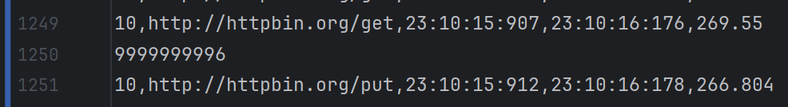

Start the project with the following command:
```bash
pip install -r requirements.txt
```
Execute monitoring.py with the following command:
```bash
python ./src/monitoring.py ./src/results.csv --use_interval
```

Problems
- look at the data in the results.csv file. There was problem that miliseconds were not being written in the row with the rest of data, but the row below. After that monitoring.py has got a problem to read it.
- 
